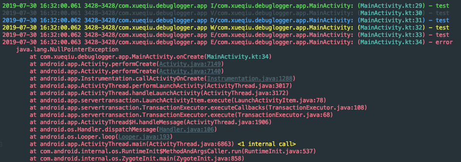

Snowball Android Debug Logger
============

Debug log utils that is easy to use.

## Installation

```groovy
repositories {
    maven { url "https://xueqiumobile.bintray.com/maven" }
}
dependencies {
    // add dependency, please replace x.y.z to the latest version
    implementation "com.xueqiu.debuglogger:logger:x.y.z"
    
    // with bugly
    implementation "com.xueqiu.debuglogger:bugly:x.y.z"
}
```

## Usage

### DLog

```kotlin
// declare your params
val map = HashMap<String, String>()
        map[BaseDebugLogger.KEY_APP_CHANNEL] = "channel"
        map[BaseDebugLogger.KEY_APP_VERSION] = "version_name"

// set option
val options = DebugLogOptions().isDebug(true)
        .withLogger(InfoLogger()) // default logger
        .withParams(map)

// init DLog
DLog.init(AppContext.INSTANCE, options)

// then use it
DLog.i("test")
DLog.v("test")
DLog.d("test")
DLog.w("test")
DLog.e("test")
DLog.e(throwable)
```

You will see logs in your terminal like this and the log is clickable.

### BuglyLogger

If you use the [bugly](https://bugly.qq.com/v2/index) to collect java crash.
```kotlin
// add logger to options
withLogger(BuglyDebugLogger("746b3e9b70")) // replace to your bugly app id

// bugly will automatically collect your crash information
// You can also manually upload crash information like below
DLog.e("test" , true)
DLog.e(throwable , true)

// get logger by id
val logger = DLog.getLogger<BuglyDebugLogger>(BuglyDebugLogger.LOGGER_ID_BUGLY)
```

### CustomLogger
In addition, you can also implement your own logger by extending BaseDebugLogger.